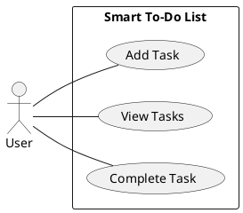
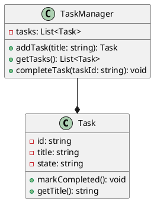
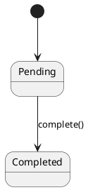

# Smart To-Do List Architecture View

## ScenarioView
1. UseCase — Scenario View: Use Case Diagram

```plantuml
@startuml UseCaseDiagram
left to right direction
actor User as "User"
rectangle "Smart To-Do List" {
  usecase "Add Task" as (AddTask)
  usecase "View Tasks" as (ViewTasks)
  usecase "Complete Task" as (CompleteTask)
}
User -- (AddTask)
User -- (ViewTasks)
User -- (CompleteTask)
@enduml
```

## LogicView
2. Class — Logic View: Class Diagram

```plantuml
@startuml ClassDiagram
class Task {
  - id: string
  - title: string
  - state: string
  + markCompleted(): void
  + getTitle(): string
}
class TaskManager {
  - tasks: List<Task>
  + addTask(title: string): Task
  + getTasks(): List<Task>
  + completeTask(taskId: string): void
}
TaskManager --* Task
@enduml
```

3. State — Logic View: State Diagram

```plantuml
@startuml StateDiagram
state Pending
state Completed
[*] --> Pending
Pending --> Completed : complete()
@enduml
```
